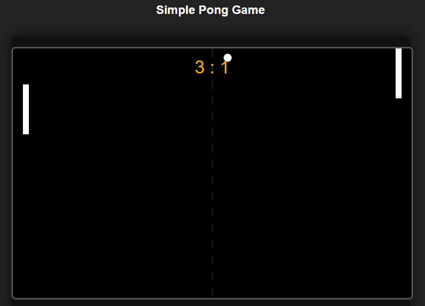

# 🕹️ Simple Pong Game

A classic Pong-style game built using **HTML5 Canvas**, **JavaScript**, and **CSS**. The game features smooth paddle control, simple AI, scorekeeping, and a retro feel.

 <!-- Add a screenshot named 'screenshot.png' to your repo root -->

## 🚀 Demo

Try it live by opening `index.html` in any modern browser.

## 🎮 Features

- Mouse-controlled left paddle
- AI-controlled right paddle
- Real-time collision detection and response
- Spin effect on paddle hits
- Score tracking
- Simple, clean UI with retro styling

## 🧱 Built With

- **HTML5 Canvas** – for drawing the game
- **JavaScript** – for game logic and interactivity
- **CSS** – for basic layout and theming

## 📂 File Structure

/pong-game
├── index.html # Main HTML file
├── script.js # Game logic in JavaScript
├── style.css # Styling for layout and visuals
└── README.md # Project documentation


## 🖥️ How to Play

- Open `index.html` in your browser.
- Move your mouse up and down to control the left paddle.
- The AI will control the right paddle.
- First to reach a high score (customize in code if desired) wins!

## 📦 Installation

Clone this repository and open the HTML file directly:

```bash
git clone https://github.com/yourusername/pong-game.git
cd pong-game
open index.html # or just double-click it
